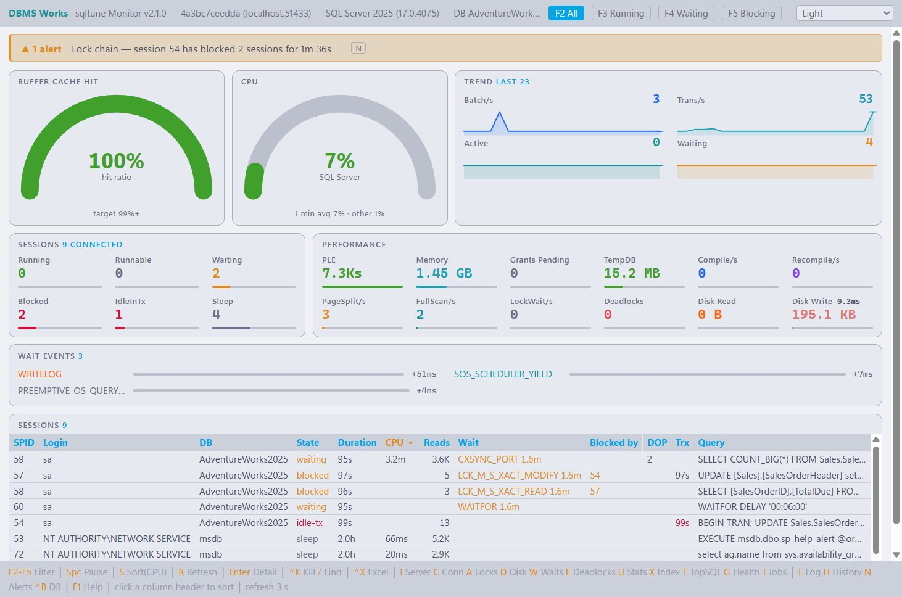
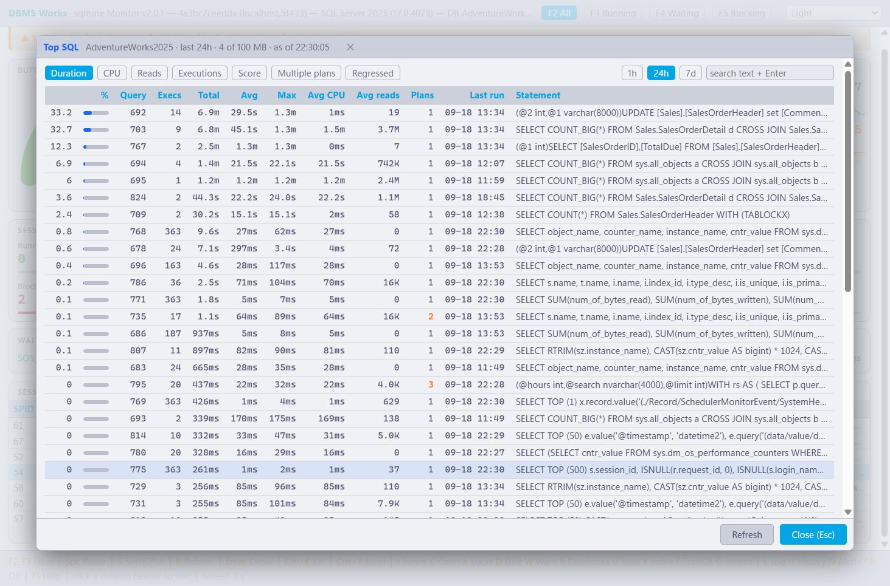
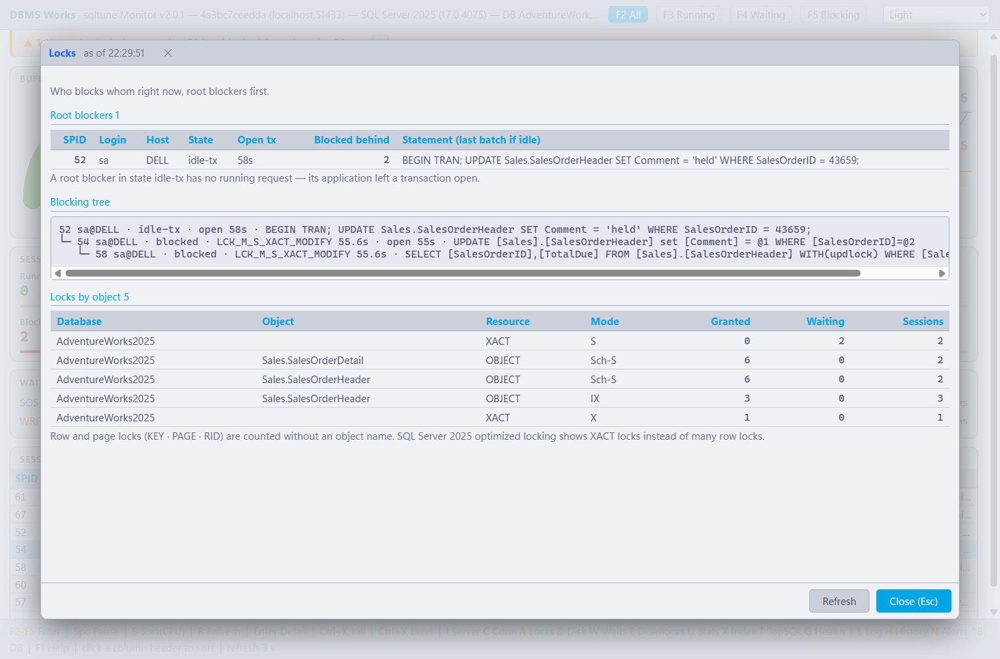
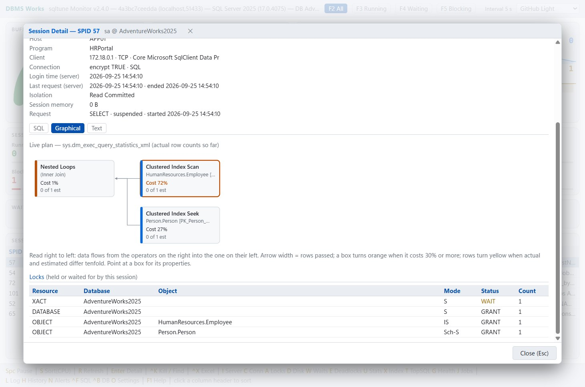
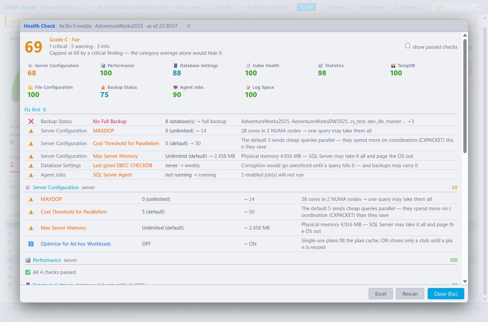
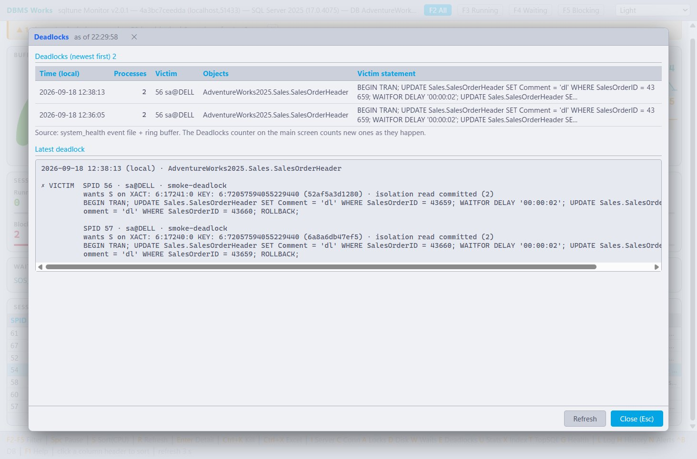
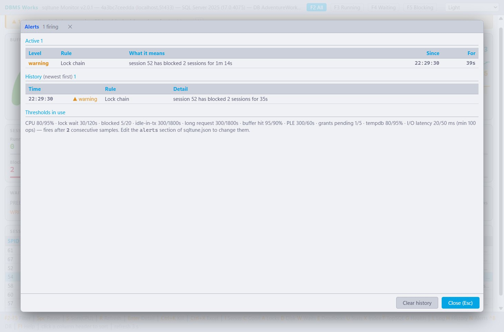
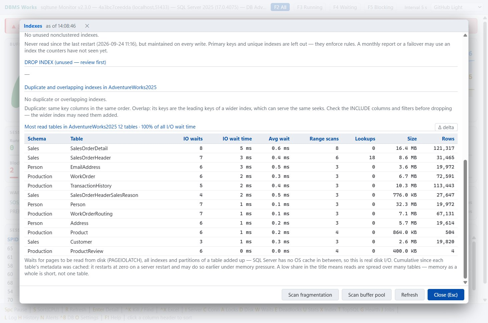

# sqltune — SQL Server 실시간 모니터 (무료)


**[최신 배포본 내려받기](https://github.com/Doni-Kim/sqltune-release/releases/latest)** ·
[English](README.md) · [매뉴얼 (HTML)](sqltune.html)

SQL Server 상태를 실시간으로 보는 데스크톱 모니터입니다. 창 하나 · 실행 파일 하나이고, 서버에는 아무것도 설치하지 않습니다 —
DMV · Query Store · 시스템 카탈로그만 읽습니다. 서버를 바꾸는 것은 세션 KILL 하나뿐이고, 그것도 확인을 누를 때만입니다.
부담 없이 쓰시라고 공유드립니다.

## 화면

| 실시간 대시보드 | Top SQL (Query Store) |
|---|---|
|  |  |

| 락 사슬 | 세션 상세 |
|---|---|
|  |  |

| Health Check | 데드락 |
|---|---|
|  |  |

| 알림 | 인덱스 진단 |
|---|---|
|  |  |

화면은 촬영용으로 잠깐 띄운 시험 서버(Docker)의 AdventureWorks 예제 DB 입니다.

## 설치·설정

- 압축을 풀고 폴더째 둔 뒤 `sqltune.exe` 를 실행하면 됩니다 (Single File Publishing).
- .NET 설치 불필요 — 런타임이 실행 파일에 포함되어 있습니다.
- 설정은 같은 폴더의 `sqltune.json` 하나입니다. 파일을 고쳐도 되고(아래 예시), 그냥 실행해도 됩니다 —
  들어 있는 값으로 붙지 못하면 그 값이 채워진 접속 창이 뜹니다. 실제로 접속된 뒤에 입력한 값을 저장합니다(비밀번호는 암호화해서 저장).

## 주요 기능

- **실시간 대시보드**: 버퍼 캐시 적중률 · SQL Server CPU · PLE · 메모리 · tempdb · 초당 배치 / 트랜잭션 / 재컴파일 / 전체 스캔 / 락 대기 ·
  디스크 처리량 · 대기 · 추이 그래프 · 세션 표. 초당 값은 늘 직전 주기 구간 값입니다(서버 시작 이후 누적이 아님).
  SQL Server CPU 는 **SQL Server 가 쓸 수 있는 CPU 대비**입니다 — affinity 나 에디션 코어 제한으로 호스트 CPU 일부만 받은 서버(예: 8개 중 4개)는
  그 4개가 다 차면 100% 이고, 게이지 아래에 "4 of 8 CPUs" 와 호스트 전체 대비 값을 함께 보여 줍니다.
- **진짜 뿌리를 찾는 락 사슬**: 트랜잭션을 연 채 쉬는 세션(`idle-tx`)까지 막힘의 뿌리로 잡습니다 — 실행 중인 요청만 보는 방식이 놓치는 흔한 원인입니다.
  `F5` 는 막는 세션과 막힌 세션을 함께 보여 줍니다.
- **세션 상세**(`Enter`): 문장 · 배치 전문, 지금까지의 실제 행 수가 든 라이브 실행 계획(없으면 캐시된 계획), 락.
  `Ctrl+K` 로 KILL(로그인 시각까지 다시 확인해 번호가 재사용된 다른 세션은 끊지 않습니다), `Ctrl+X` 로 Excel 저장 — 플랜 · 락 · 플랜에 나온 테이블의 크기 · 인덱스 · 통계까지.
- **팝업**: Server(`I`) · Connections(`C`) · Locks(`A`) · Disk(`D`) · Waits(`W`) · Deadlocks(`E`, system_health 에서, 최근 것은 풀어서) ·
  Statistics(`U`, UPDATE STATISTICS 스크립트) · Indexes(`X`: 누락(CREATE) · 미사용(DROP) · 중복 · 겹침, 조각화는 버튼으로).
- **Top SQL**(`T`): Query Store 에서 시간 · CPU · 읽기 · 실행 수 · 종합 점수 순으로 1시간 / 24시간 / 7일, 플랜이 여러 개인 문장,
  느려진 쿼리(앞 7일보다 2배 이상), 문장 검색, 쿼리별 플랜 이력과 플랜 강제 스크립트(보여 주기만 하고 실행하지 않음).
- **Health Check**(`G`): 10개 범주(서버 설정 · 성능 · DB 설정 · 인덱스 · 통계 · tempdb · 파일 · 백업 · Agent 작업 · 로그)를
  점수 · 등급 · 먼저 고칠 것으로 보여 주고 Excel 로 저장. MAXDOP 은 NUMA 노드 기준, PLE 는 버퍼 풀 크기 기준, 백업은 서버 시계 기준으로 판정합니다.
- **임계값 알림** 12종: CPU(SQL Server 가 쓸 수 있는 CPU 대비) · 락 사슬 · 막힌 요청 · idle in transaction · 긴 요청 · 버퍼 캐시 적중률 · PLE · Memory Grants Pending ·
  tempdb 사용률 · 디스크 읽기 / 쓰기 지연 · 데드락.
- **History**: `L` 로 로컬 SQLite 에 모니터링 데이터를 쌓고, `H` 로 지난 흐름을 되짚습니다.
  - 구간은 1시간 / 6시간 / 24시간 / 1주 / 1개월 / 전체, 지표는 20가지입니다.
  - 오래된 기록은 자동으로 지웁니다(기본 지표 30일 · 세션 7일, `sqltune.json` 에서 조정).
- Excel 저장: ClosedXML 기반이라 Excel 이 없어도 xlsx 파일이 저장됩니다.
- 테마 12종(밝은 6 · 어두운 6). 접속이 끊기면 스스로 다시 붙습니다.
- `Ctrl+B` 로 DB 단위 팝업이 볼 데이터베이스를 바꿉니다. `F1` 을 누르면 단축키 도움말이 나옵니다.

자세한 사용법은 첨부한 `sqltune.html`(스크린샷이 든 매뉴얼)을 참고해 주세요. 사용상 제한 없습니다.

## 지원 범위 · 제약사항

- UI 가 Web 기반(Blazor Hybrid)이라 **Windows 전용**입니다. Linux·macOS 에서는 단독 실행되지 않습니다.
- **SQL Server 2019 이상** — 온프레미스 · VM · Managed Instance. SQL Server 2025 에서 개발 · 확인했습니다.
- **Azure SQL Database 는 지원하지 않습니다** — 접속하면 접속 창에서 알려 줍니다.
- **Top SQL 은 Query Store 가 필요합니다**(보는 DB 에). SQL Server 2022 부터 새 DB 는 기본으로 켜져 있고,
  꺼져 있으면 켜는 문장을 팝업이 보여 줍니다.
- 코드는 ConfuserEx 로 난독화(무료 툴이라 강력한 수준은 아닙니다).

## 모니터링 전용 계정

SQL Server 2025 에서 확인했습니다 — 아래 권한이면 모든 팝업과 Health Check 가 `sa` 로 볼 때와 같습니다.

```sql
USE master;
CREATE LOGIN sqltune WITH PASSWORD = '...';
GRANT VIEW SERVER STATE    TO sqltune;   -- 대시보드 · 세션 · 대기 · 락 · 데드락 · 실행 계획
GRANT VIEW ANY DEFINITION  TO sqltune;   -- Disk: 모든 DB 의 파일 · 볼륨
GRANT ALTER ANY CONNECTION TO sqltune;   -- 선택: Ctrl+K (KILL)

-- Ctrl+B 로 보는 DB 마다 (Top SQL · 인덱스 · 통계 · Health Check)
USE YourDatabase;
CREATE USER sqltune FOR LOGIN sqltune;
GRANT VIEW DATABASE STATE TO sqltune;           -- Query Store · 인덱스 사용량 · 로그 공간
GRANT VIEW DEFINITION     TO sqltune;           -- 인덱스 · 통계 메타데이터
ALTER ROLE db_datareader ADD MEMBER sqltune;    -- 선택: 통계 — 아래 참고

-- Health Check: 백업 · Agent 작업
USE msdb;
CREATE USER sqltune FOR LOGIN sqltune;
GRANT SELECT  ON dbo.backupset      TO sqltune;
GRANT SELECT  ON dbo.sysjobs        TO sqltune;
GRANT SELECT  ON dbo.sysjobhistory  TO sqltune;
GRANT EXECUTE ON dbo.agent_datetime TO sqltune;
```

- `sys.dm_db_stats_properties` 는 그 로그인이 읽을 수 있는 테이블의 통계만 돌려주므로, `db_datareader` 가 없으면
  Statistics 팝업과 Health Check 의 통계 범주가 비어 보입니다. 나머지는 없어도 됩니다.
- `VIEW ANY DEFINITION` 이 없으면 Disk 팝업에 파일 · 볼륨이 나오지 않습니다.
- Agent 점검에는 `SQLAgentReaderRole` 로는 부족합니다 — 그 역할은 Agent 프로시저용이고 작업 테이블을 직접 읽지는 못합니다.
- 권한이 모자라면 빈 목록 대신 어떤 권한이 필요한지 팝업에 적어 줍니다.

## 화면이 안 뜬다면 (WebView2)

창은 뜨는데 내용이 백지라면 WebView2 런타임이 없는 경우입니다.

- **Windows 11**: OS 에 기본 내장이라 항상 있습니다.
- **Windows 10**: 2021년 이후 Windows Update 로 대부분 자동 배포됐지만, 업데이트를 오래 안 한 PC 나 LTSC 같은 특수 에디션에는 없을 수 있습니다.
- **Windows Server (2016/2019/2022)**: 기본 미포함인 경우가 많아 별도 설치가 필요할 수 있습니다.

없으면 Microsoft 의 "에버그린 독립형 설치 프로그램"(`MicrosoftEdgeWebView2RuntimeInstallerX64.exe`)을 설치하시면 됩니다.
→ https://developer.microsoft.com/microsoft-edge/webview2/

## 문제가 생기면

오류가 나면 실행 파일 옆에 `sqltune.log` 가 생깁니다(평소에는 만들지 않습니다).

- **버그 · 질문**: [Issues](https://github.com/Doni-Kim/sqltune-release/issues) 에 남겨 주세요.
  로그 파일은 거기에 올리지 마세요 — 비밀번호는 없지만 서버 주소와 SQL 문장이 들어 있을 수 있습니다.
- **로그 파일**이나 공개하기 어려운 내용은 메일로 보내 주세요: **doniikim@gmail.com**

## 기술 스택

- .NET 11.0 (x64), C# 15, Blazor Hybrid
- 패키지: Microsoft.Data.SqlClient · Microsoft.Data.Sqlite · ClosedXML · Microsoft.Web.WebView2 · Microsoft.AspNetCore.Components.WebView.WindowsForms
- 실행 파일에 묶인 위 구성 요소들의 저작권 고지 · 라이선스 전문: [THIRD-PARTY-NOTICES.txt](THIRD-PARTY-NOTICES.txt) (zip 안에도 들어 있습니다)

## sqltune.json 예시

zip 에는 기본값(`127.0.0.1:1433` · `sa`)이 든 작은 `sqltune.json` 이 들어 있습니다. 고쳐서 쓰거나, 접속 창에 맡기면 됩니다:

```json
{
  "databases": [
    {
      "userId": "sa",
      "password": "<password>",
      "server": "127.0.0.1",
      "port": "1433",
      "database": "master",
      "encrypt": "mandatory",
      "trustServerCertificate": true
    }
  ],
  "interval": 5
}
```

- `password` 는 평문으로 적으면 첫 실행 때 자동 암호화되어 `ENC1:...` 로 저장됩니다.
- 이름 있는 인스턴스는 `server` 에 `HOST\\INSTANCE` 로 쓰고 `port` 는 비우거나 `1433` 으로 둡니다(SQL Browser 로 포트를 찾습니다).
- `database` 는 DB 단위 팝업이 처음 볼 DB 이고 `Ctrl+B` 로 바꿉니다. 세션 목록은 늘 서버 전체입니다.
- `encrypt`: `mandatory`(기본) / `optional` / `strict`. `trustServerCertificate` 는 자체 서명 인증서를 받아들일지입니다.
- `alerts`, `logRetention` 같은 절은 적지 않아도 됩니다. zip 안의 `sqltune_sample_kr.json` 에 모든 설정의 설명이 있습니다.

## 사용 조건

업무든 개인이든 자유롭게 쓰셔도 됩니다. 실행 파일 재배포와 리버스 엔지니어링은 삼가 주세요.
소스는 공개하지 않습니다.

## 연락처

DBMS Works — **doniikim@gmail.com**

Oracle → PostgreSQL / MySQL 마이그레이션, DB 성능 튜닝 문의도 받습니다.
